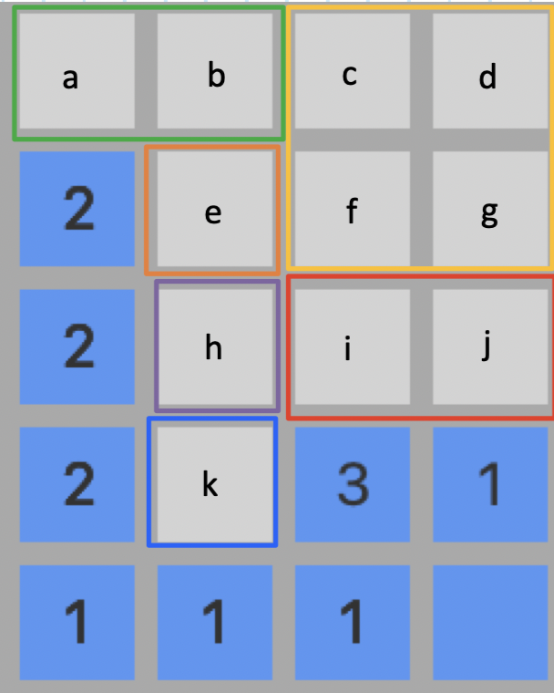

# minesweeper

## Description

Minesweeper game with GUI supported by JavaFX. Notable feature is different bot strategies:

1. Linear
    - Clears tiles one by one and is guaranteed to hit a mine. This will always lose.
2. Random
    - Picks a random tile to clear each turn.
3. Probabilistic
    - On each turn, computes the probability that each tile in a game state has a mine, and clears the least likely tile.
    - Approximate win rates:
        - MINI: 70%
        - EASY: 96%
        - MEDIUM: 79%
        - HARD: ~33%
        - EXPERT:

## To-do
- [ ] Fix bug that largely affects larger games - 0 solutions are found and the bot crashes with a 0/0 error.
- [ ] Performance analysis.
- [ ] Complexity analysis of the algorithm.
- [X] Better write up, with diagrams.
- [X] Write up how to describe computations.

## Probabilistic Algorithm

### Definitions and Terminology

- We will define $B$ as the **minesweeper board configuration**. We define $B$ as the union $B = C \cup U$ where $C$ is the set of cleared tiles and $U$ is the set of uncleared tiles. Naturally, $C \cap U = \emptyset$.
    - A minesweeper board is rectangular with $h$ rows and $w$ columns, and with a set of tiles with mines $M$ such that $M \subseteq U$.
    - It follows that a minesweeper configuration is "solved" when $M = U$. That is, the only uncleared tiles remaining are those with mines.
- Let $t_k$ be the $k^\text{th}$ **tile** located at row $x$ and column $y$, where $k = wx + y$. The top left corner of a minesweeper configuration is $(x = 0, y = 0)$, so $x = 0, \dots, h - 1$ and $y = 0, \dots, w - 1$. So, we see that $k = 0, 1, \dots, hw - 1$.
    - Consequently, we also see that $$B = \bigcup_{k = 0}^{hw - 1} \{t_k\}$$ and $|B| = hw$.
    - We define the probability function that a given tile $t_k$ has a mine as $p: U \rightarrow [0, 1]$ such that $p(t) = \mathbb{P}(t \in M)$.

    - The **minimum-likelihood tile** is a tile $t_\text{min} \in U$ which minimizes $p(t)$.
- A minesweeper board configuration will have a **density**, which is the probability that a given unopened tile $t_k \in U$ has a mine for all $k = 0, 1, \dots, hw - 1$. This density is $\rho = |M|/|U|$.
    - For instance, an *easy* difficulty game has 10 mines, 9 rows, and 9 columns. So, an initial state without any cleared tiles will have $|M|$ = 10 and $|U| = 9 \cdot 9 = 81$, so it has a density of $\rho = 10/(9 \cdot 9) \approx 0.12346$.
- A minesweeper board configuration $B$ can be separated into $n$ disjoint **TileSets**, notated by $S_i$, where $i = 0, \dots, n - 1$. So, $$B = \bigcup_{i = 0}^{n - 1} S_i$$ where $S_i \cap S_j = \emptyset$ for $i, j = 0, 1, \dots, n - 1$, $i \not = j$.
    - A TileSet is a set of tiles $t_k$ such that each tile within the set share the same common neighboring cleared tiles. This is best illustrated in the following image:

    <div style="text-align:center;">
        
    </div>

    - In this configuration, the tiles labeled $a, b, c, d, e, f, g, h, i, j, k \in U$, and $C = B \setminus U$ (that is, the cleared tiles are those that are not uncleared). The tiles in this configuration are grouped into $n = 6$ TileSets, represented by the differently colored rectangles. We group $S_0 = \{a, b\}$ because $a$ and $b$ share the cleared tile at row 1, column 0. Note that we have $S_1 = \{c, d, f, g\}$, because they all do not have any neighbors, and hence belong to the same TileSet. The remaining tiles are grouped the same way into their own TileSets.
    - We can consider $S$ to be the set of all TileSets (so $|S| = n$).
    - I can define the probability function for tile sets, which I will notate as $P: S \rightarrow [0, 1]$ such that $P(s) = \mathbb{P}(\exists t \in s, t \in M)$.
        - A consequence of this definition is that for each $t \in s$, $p(t) = P(s)$.
- A **TileSetRule**, or rule for short, is a linear equation with the result determined by the non-zero numbered cleared tiles. The variables in each equation correspond to a TileSet. A solution to a TileSetRule will provide information about how many tiles contain mines within a TileSet. The $j^\text{th}$ rule will be denoted by $R_j$.
    - $\alpha_i$ will be defined as the number of mines within TileSet $i$. Similarly, $\beta_j$ will be defined as the result of the rule $j$.
    - So, a rule $R_j$ is thus $$R_j: \alpha_{k_0} + \alpha_{k_1} + \dots + \alpha_{k_{s_j}} = \beta_j$$
    - We see that a rule will have $s_j$ variables, where $1 \leq s_j \leq n - 1$ and $k_0, k_1, \dots, k_{s_j}$ are distinct integers in the range $[0, n - 1]$. Also, for each $i = 0, 1, \dots, n - 1$, $0 \leq \alpha_i \leq \min(|M|, |S_i|)$.
    - A minesweeper configuration will have a set of rules $R$. This set of rules is a system of linear equations, whose solutions provide information about the number of mines in each TileSet.
    - A minesweeper configuration will also include the **global rule**, denoted by $R_0$, defined as $$R_0: \sum_{k = 0}^{n - 1} \alpha_k = |M| = \beta_0$$
    - Thus, if we have $c$ cleared and non-zero numbered tiles, then $|R| = c + 1$, to account for the global rule.
    - An example will now be provided, using the image from above. Suppose that $|M|$ = 6. We see that there are 8 cleared non-zero numbered tiles, meaning that $|R| = 8 + 1 = 9$. We have the following TileSets, each associated with a $\alpha_k$:
    $$S_0 = \{a, b\}: \alpha_0$$
    $$S_1 = \{c, d, f, g\}: \alpha_1$$
    $$S_2 = \{e\}: \alpha_2$$
    $$S_3 = \{h\}: \alpha_3$$
    $$S_4 = \{i, j\}: \alpha_4$$
    $$S_5 = \{k\}: \alpha_5$$
    - We also have each $\beta_j$: $\beta_0 = 6, \beta_1 = 2, \beta_2 = 2, \beta_3 = 2, \beta_4 = 1, \beta_5 = 1, \beta_6 = 1, \beta_7 = 3, \beta_8 = 1$.
    - We can now define the rules, beginning with the global rule $R_0$:
    $$R_0: \alpha_0 + \alpha_1 + \alpha_2 + \alpha_3 + \alpha_4 + \alpha_5 = 6$$
    $$R_1: \alpha_0 + \alpha_2 + \alpha_3 = 2$$
    $$R_2: \alpha_2 + \alpha_3 + \alpha_5 = 2$$
    $$R_3: \alpha_3 + \alpha_5 = 2$$
    $$R_4: \alpha_5 = 1$$
    $$R_5: \alpha_5 = 1$$
    $$R_6: \alpha_5 = 1$$
    $$R_7: \alpha_3 + \alpha_4 + \alpha_5 = 3$$
    $$R_8: \alpha_4 = 1$$
    - So, our set $R = \{R_0, R_1, R_2, R_3, R_4, R_5, R_6, R_7, R_8\}$. Ultimately, the goal of a probabilistic algorithm is to count the number of solutions to this system of linear equations.
- A **solution tree** is a recursive structure which details the different attempted solutions to the system of linear equations established by $R$. A solution tree is composed of **result nodes**, each of which store a running solution to the system. The $i^\text{th}$ result node is denoted by $\sigma_i$. The leaves of the solution tree are the set of all possible solutions, called the **solution set**, denoted by $\Sigma$.
    - In the implementation, a result node $\sigma_i$ is a mapping of each $S_k$ to its corresponding $\alpha_k$, done with a HashMap. A result node also has a reference to the current simplified rules. Rule simplification is detailed in the next section.
    - A result node is added to the solution set once it is *complete*. A node is considered complete if each $\alpha_k$ has been given a value. A complete node is a leaf node in the solution tree.

### The Algorithm

Given a game configuration $B$, my probabilistic algorithm will output a *minimum-likelihood tile* $t_\text{min}$. The algorithm is as follows:

1. All tiles $t \in U$ are grouped into $n$ TileSets. The set of all TileSets is $S$.
2. The algorithm then collects all TileSetRules $R$.
    - Rules can be **simplified**:
        - Simplifying a rule involves substitution in known values for variables and removing these from the rule. For instance, if we have a rule $$\alpha_0 + \alpha_1 + \alpha_2 = 2$$, and we know that $\alpha_0 = 1$, then clearly $\alpha_1 + \alpha_2 = 2$.
        - There are three base cases that one can hit after simplifying a rule successfully:
            1. There is one variable remaining.
                - If we end up with a rule with only one TileSet e.g. $\alpha_0 = 3$, then trivially, the TileSet $\alpha_0 = 3$.
            2. The result of the rule is 0.
                - If we end up with a rule like $\alpha_0 + \alpha_1 + \alpha_2 = 0$, we can easily assign the number of mines within TileSets $\alpha_0 = 0$, $\alpha_1 = 0$, and $\alpha_2 = 0$.
            3. The result is equal to the number of Tiles within the TileSets in the rule.
                - For instance, if we have TileSets $S_0 = \{a, b, c\}$ and $S_1 = \{d, e\}$, and the rule $S_0 + S_1 = 5$, then we can assign a value of $3$ to $S_0$ and a value of $2$ to $S_1$.
3. The algorithm now traverses the solution tree.
    - The following are the steps of building the solution tree to populate the final supposed results:
        1. Create the root with a ResultNode where each TileSet $S_k$ maps to a null $\alpha_k$.
        2. Select the smallest unknown TileSet, $S_{\text{min}}$, within the supposed result – that is, select the TileSet with the least number of Tiles that has a null $\alpha_k$.
        3. Assign values in the range $[0, |S_{\text{min}}|]$ to $\alpha_k$. Attempt to simplify each rule.
            - If the result of a simplification is ever invalid, this branch of the solution tree is no longer traversed.
            - If the result of the simplification is valid, we recursively continue.
        4. If the result node is complete, we stop and add this to the solution set. At this point, we have reached a leaf node in the tree. Otherwise, we repeat recursively from step 2.
    - Here is pseudocode for this process:
        ```
        SolutionSet solutionSet = initialize empty solution set;

        void buildSolutionSet() {
            initialize TileSet : (alpha = null) mapping;
            initialize ResultNode root with rules and mapping;
            buildSolutionSetHelper(root);
        }

        void buildSolutionSetHelper(ResultNode current) {
            if (current is complete) {
                add current to SolutionSet;
                return;
            }

            TileSet smallest = smallest unknown TileSet in current's rules;

            for (int i = 0; i <= min(|smallest|, |M|); i++) {
                ResultNode child = copy of current;
                set smallest's alpha = i;
                simplify all of child's rules;
                if (is valid simplification) {
                    buildSolutionSetHelper(child);
                }
            }
        }
        ```

4. With the solution set built, we can begin computing probabilities.
    - For each result node $\sigma_j$ in the solution set, we find the total number of combinations per result node, which will be denoted $c_j$. This is computed as follows: $$c_j = \prod_{k = 0}^{n - 1} \binom{|S_k|}{\alpha_k}$$
    - The total number of possible combinations across all possible solutions is thus the sum, which I will denote $\chi$:
    $$\chi = \sum_{j = 0}^{|\Sigma| - 1}c_j$$
    - We now have enough information to define the probability functions $P(s)$, for each $s \in S$. The function $P(s)$ is thus defined as follows:
    $$P(s) = \frac{1}{\chi}\sum_{j = 0}^{|\Sigma| - 1} \frac{a(s, j)}{|s|} c_j$$
    where $a$ is a function $a : S \times \{0, 1, \dots, |\Sigma| - 1\} \rightarrow \mathbb{Z}$ such that $\alpha(s, j) = \text{value of alpha in the ith result node}$.
    - The algorithm applies $P(s)$ for each $s \in S$, and then, using  probabilities are assigned to each tile in the game configuration.

5. Pick the minimum likely TileSet. This is the TileSet with the lowest probability of containing a mine. Then, randomly pick a Tile within this TileSet, and clear it. This approach works due to the property that for each $t \in s$, $p(t) = P(s)$, for each $s \in S$. The game configuration is now updated upon clearing, and we repeat from the start until the game ends (either a win or a loss).

## JavaFX and GUI

Compile with: javac --module-path /path/javafx-sdk-11.0.2/lib --add-modules javafx.controls *.java

Run with: java --module-path /path/javafx-sdk-11.0.2/lib --add-modules javafx.controls Game

Uses a simple file-based leaderboard system, saving the results into a local csv file in the same directory as the game.

## Some sources

Main algorithm inspiration: https://codereview.stackexchange.com/questions/54737/analyzing-minesweeper-probabilities

https://dash.harvard.edu/bitstream/handle/1/14398552/BECERRA-SENIORTHESIS-2015.pdf

https://www.claymath.org/sites/default/files/minesweeper.pdf

https://minesweepergame.com/math/explorations-of-the-minesweeper-consistency-problem-2003.pdf

https://www.minesweeper.info/articles/SomeMinesweeperConfigurations.pdf

https://web.mat.bham.ac.uk/R.W.Kaye/minesw/infmsw.pdf

https://www.youtube.com/watch?v=G2kd745uYuo&ab_channel=CodingChannel
